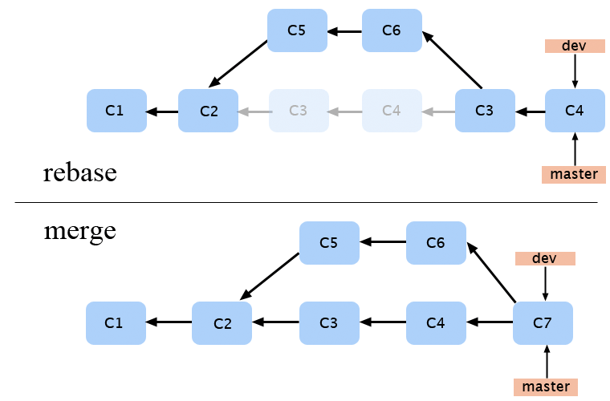
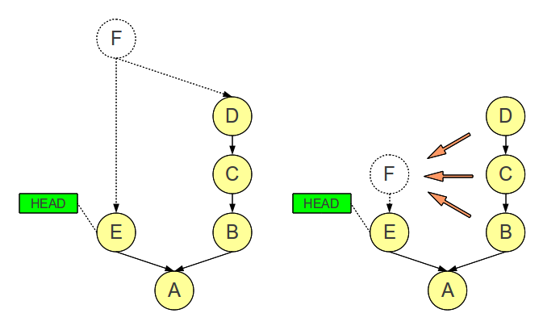
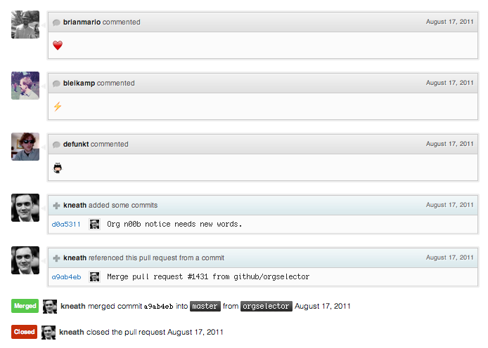

#   Git İş Akışı

.fx: first

pasali `<mhmtbsl@bil.omu.edu.tr> `          
Ruziye Dağcı `<ruziye.dagci@bil.omu.edu.tr>`

http://mhmtbsl.net/

Şubat 2014

---

##   Git Kullanımı Ve Olası Sorunlar

-   Diğer geliştricilerinin değişikliklerinin üzerine yazmak(git push --force)

        git config --system receive.denyNonFastForwards true

-   Yerel deponuzda commitlenmemiş değişikliklerinizin üzerine yazmak

-   Conflicts(çakışmalar)

---

##   Çakışmalar(conflict) Nasıl  Çözülür?

-   meld, vimdiff, diffmerge, git-mergetool...
-   Basit bir text editorde iş görür
-   Conflict örneği;

        <<<<<<< HEAD
        Hello, master change.
        =======
        Hello, branch b1 change.
        >>>>>>> b1

---

##   Değişiklik(Commit) Mesajları Nasıl Yazılır?

-   En fazla 50 karakterlik bir başlık(işi özetleyen)
-   Başlık büyük harfle başlayacak(sonda nokta yok)
-   En fazla 72 karakterlik bir açıklama (gerekirse)
-   Başlık ve açıklama boş satır ile ayrılacak
-   "düzeltme", "ekleme" yerine "düzeltildi", "eklendi"

---

##   Örnek Değişiklik (Commit) Mesajı

        bin: Kopyala yapıştır hatası düzeltildi

        Kopyala yapıştırla gelen "estetik tırnaklar"dan dolayı bu ayar
        etkin olduğunda veritabanı bağlantıları kopuyordu. Sadece bu
        iğrenç hata nedenle yarım saat harcadım. İbret alınsın!
---

##   Değişiklik (Commit) Mesajını Düzeltme

-   Son değişiklik(Commit) mesajını düzeltme

        git commit --amend -m "Yeni mesaj buraya"

-   Text Editor ile düzeltmek için

        git commit --amend

-   Herhangi bir commit'i düzeltmek için

        git log --oneline # commit idsini öğrenmek için
        git rebase -i {id}^
        # Açılan pencerede "pick" değişip "reword" yapıp kaydedince
        # düzeltme penceresi açılır

---
##   Projeye Yeni Özellik Ekleme

-   Yeni bir dal oluşturulur
-   İyi pratik açısından özellikle ilgi bir isim verilir
-   Dala geçiş yapılır
-   Özellik çalışır duruma geldiğinde `master` dalına birleştirilir

---

##   Hata düzeltme

-   Yeni özellik ekleme gibi düşünülebilir
-   Yeni bir dal oluşurturulur
-   Hata çözülür, `master` dalına birleştirilir

---

##   Kişisel kopya nasıl yönetilir ? 

-   Birden fazla geliştirici ile çalışıyorsunuz
-   Önce asıl repo'yu fork ettiniz
-   `git clone` ile makinenize kopayaladınız
-   Yeni bir dal açıp özeliğinizi eklediniz
-   Yeni dalı fork ettiğiniz repo'nuza yolladınız
-   Artık bir adet `pull request` açarak  değişiliğinizi repo sahibine
    yollayabilirsiniz.

---

##   Git - rebase

-   `git merge` gibi dalları birleştirir
-   Commit geçmişinin doğrusal olmasını sağlar
-   Commit geçmişini bozar
-   Ortak çalışalan depolarda kullanılmamalıdır.
        
        git checkout dal_ismi
        git rebase master
---

##  Merge vs. Rebase

   

---

##  Git merge --squash

-   Hata çözdünüz veya yeni bir özellik eklediniz
-   Bütün dalı` merge` etmek yerine
-   İlgili daldaki bütün commit'leri tek bir commit'e sığdırmak isteyebilirsiniz
-   İşte tam burda `merge --squash` yardımınıza koşuyor

        git merge --squash dal_ismi
        git commit -m '... çözüldü.'

---

##  merge Vs. merge --squash

 

---

##  Git Workflows

-   Centralized Workflow
-   Gitflow Workflow
-   Github Workflow (feautre branch)
-   Forking Workflow
-   Pull requests

Ayrıntılı bilgi
[burda](https://www.atlassian.com/git/workflows#!workflow-feature-branch)

---

##   Github Workflow

-   `master` dalı stabil olmalı
-   Dallarla(branch) çalış
-   İlgili dalı sunucuya gönder
-   Takıldığın yerde `pull request` aç
-   İstek onaylanırsa `merge` yap
-   `master` dalına gönder

---

##  `master`dalı stabil olmalı 

-   Sistemin ana kuralı
-   Tek özel ve sabit  anlam taşıyan dal: `master`
-   Her şey dağıtıma hazır, her an servis edilebilir
-   Her zaman kararlı

---

##  Dallarla(branch) çalış

-   Her yeni özellik ya da hata için yeni dal
-   Dal isimleri işlerle alakalı olmalı
-   Kimin ne iş yaptığı belli
-   Geri dönülmesi kolay

---

##  Dallarla(branch) çalış 

---

##  İlgili dalı sunucuya gönder

-   Sadece `master` önemli
-   Yan dalların sunucuya gitmesi sorun çıkarmaz
-   Ayretten yedekleme yapmış olunur
-   Basit bir `git fetch` ile TODO list olur 

---

##  İlgili dalı sunucuya gönder

        $ git fetch
        remote: Counting objects: 3032, done.
        remote: Compressing objects: 100% (947/947), done.
        remote: Total 2672 (delta 1993), reused 2328 (delta 1689)
        Receiving objects: 100% (2672/2672), 16.45 MiB | 1.04 MiB/s, done.
        Resolving deltas: 100% (1993/1993), completed with 213 local objects.
        From github.com:github/github
          * [new branch]      charlock-linguist -> origin/charlock-linguist
          * [new branch]      enterprise-non-config -> origin/enterprise-non-config
          * [new branch]      fi-signup  -> origin/fi-signup
          2647a42..4d6d2c2  git-http-server -> origin/git-http-server
          * [new branch]      knyle-style-commits -> origin/knyle-style-commits
          157d2b0..d33e00d  master     -> origin/master
          * [new branch]      menu-behavior-act-i -> origin/menu-behavior-act-i
          ea1c5e2..dfd315a  no-inline-js-config -> origin/no-inline-js-config
          * [new branch]      svg-tests  -> origin/svg-tests
          87bb870..9da23f3  view-modes -> origin/view-modes
          * [new branch]      wild-renaming -> origin/wild-renaming

---

##  Takıldığın yerde `pull request` aç

-   Hata ile karşılaştığınızda
-   Yardıma ihtiyaç duydugunuz durumlarda
-   Tasarımcı ile ortak çalışırken 
-   Tavsiye almak için 

---

##  Takıldığın yerde `pull request` aç

---

##  İstek onaylanırsa `merge` yap

-   `pull request` onaylandıktan sonra `merge` yapılır

---

##  `master` dalına gönder

-   Her şey kullanıma hazır artık `master` dalına `push` edilebilir

---

##  Kaynaklar

-   http://scottchacon.com/2011/08/31/github-flow.html
-   http://tbaggery.com/2008/04/19/a-note-about-git-commit-messages.html
-   https://www.atlassian.com/git
-   http://blackbe.lt/common-git-problems-and-solutions/

---

##  Sorular ?

---
