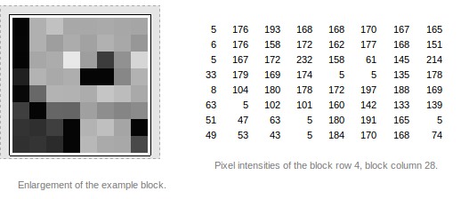
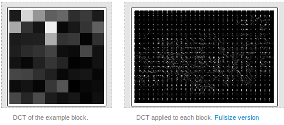
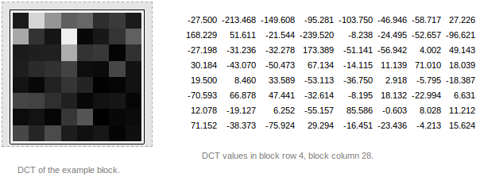
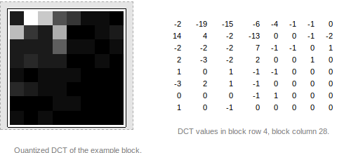
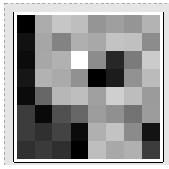
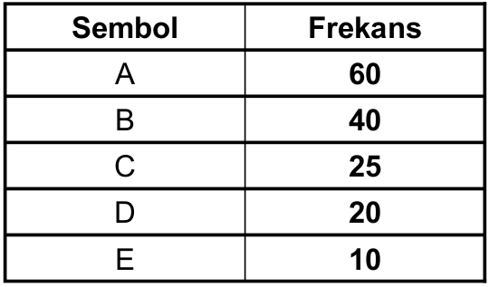
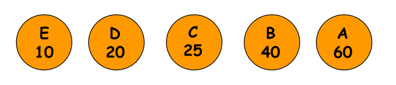
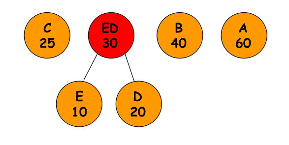
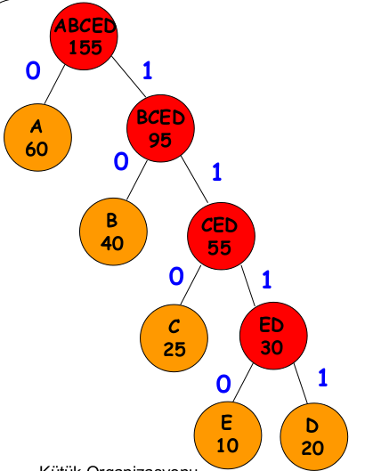
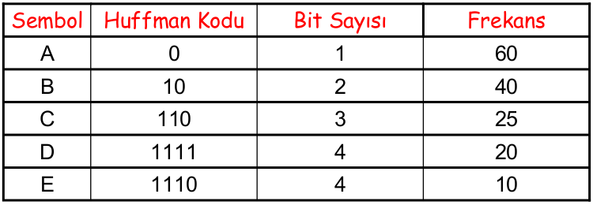

#   Veri Sıkıştırma

.fx: first

pasali `<mhmtbsl@bil.omu.edu.tr>`

http://mhmtbsl.net/

Kasım 2013

---

##   Giriş

Nedir?
: Verilen diskte daha az yer kaplaması için belirli bir algoritmaya dayalı `bit`
  seviyesinde yapılan işlem

---

##  Niye Kullanıyoruz ?

-   Verilerin daha az yer kaplaması
-   Verilen yedeklenmesi ve arşivlenmesi
-   İndirme/Yükleme işlemlerinin hızlanması
-   Verilen korunması

---

##  Sıkıştırma Teknikleri

-   İki çeşit sıkıştırma türü vardır

        * Kayıplı sıkıştırma

        * Kayıpsız sıkıştırma

---

##  Kayıplı Sıkıştırma

-   Veri kaybının önemsiz olduğu durumlarda
-   Ses, resim ya da video dosyalarında
-   Jpeg, Mpeg, Mp3, Mp4...
-   Kayıplı olduğu için sıkıştırma oranı yüksek

---

##  Kayıpsız Sıkıştırma

-   Verilerin kritik olduğu durumlarda
-   Eksiksiz geri dönüşüm gerektiren dosyalarda
-   Metin dosyaları, programlar ya da kaynak kodlar
-   Djvu, Rar, Zip, Tar...
-   Kayıp az olduğu için sıkıştırma oranı düşük

---

##  Jpeg

4 aşamadan oluşmakta:

-   Preprocessing
-   Transformation
-   Quantization
-   Encoding

---

##  Preprocessing

-   RGB renk uzayından YCbCr dönüştür
-   8x8'lik piksel bloklarına böl
-   Her pikselden 127 değerini çıkar

---

##  Transformation

DCT (The Discrete Cosine Transformation)

-   Jpeg dosya sıkıştırma işleminde kullanılan bir standart
-   Matemiksel bir işlem
-   8x8'lik bloklara DCT uygula
-   Matematiksel işlemlere ugun hale getir

---

##  Quantization

-   Değeri sıfır yakın pikselleri  sıfır yap
-   Büyük değerli pikselleri daralt ve sıfıra yaklaştır
-   Piksel değerlerini tamsayıya yuvarla

---

##  Quantization (Devam)

Önce
:

Sonra
:

---

##  Encoding

-   Huffman algoritmasını uygula (kayıpsız sıkıştırmada bahsedilecek)
-   Her bite 127 ekle

Önce:

Sonra:

---

##  Kayıplı Ses Sıkıştırma

-   İnsanın algılayamayacağı sesleri kodlamanın dışında bırakır
-   Ara işlemlerle sıkıştırma oranını artırır
-   Eski haline döndürülemez
-   Aradaki fark anlaşılamaz

---

##  Mp3

MPEG-1 Audio Standardı üç farklı sıkıştırma düzeyine sahip:

-   Layer I
-   Layer II
-   Layer III

---

##  Mp3

-   MPEG-1 Layer III Mp3 olarak bilinmekte
-   128 kbit/s bant genişliği ile kodlar
-   1/12 bit oranı ile sıkıştırma yapar
-   Değişken bit oranı (Veriable Bit Rate - VBR)
-   Sesdeki karmaşık kısımlarda yüksek bit oranı kullanır
-   Durağan kısımlarda düşük bit oranı kullanır

---

##  Mp3

VBR dezavantajları:

-   Müzikçalarların zamanı yanlış göstermesi
-   Radyo ve televizyon yayınları için elverişli değil

---

##  Kayıpsız Dosya Sıkıştırma

Dosya Skıştırma Yöntemleri:

-   Run-Lenght Yöntemi
-   Huffman Yöntemi

---

##  Dezavantajları

-   İnsanlar tarafından anlaşılmaz
-   Kodlamada ekstra maliyer
-   Kod çözme modüllerine olan ihtiyaç
-   Karmaşıklık artar

---

##  Run-Lenght Yöntemi

-   Aynı byte dizinin sık kullanıldığı dosyalar için uygun
-   Tekrar eden dizin 3 byte ile değiştirilir
-   Bu 3 byte:

        * Özel bir escape karakteri (FF)
        * Tekrar eden değer
        * Tekrar sayısı

---

##  Run-Lenght Örnek

-   Veri seti:          22 23 24 24 24 24 24 24 25 26
-   Kodlama sonucu:     22 23 FF 24 06 25 26
-   FF: Escape karakteri
-   24: Tekrar eden değer
-   06: Tekrar sayısı

---

##  Run-Lenght

-   Belirli bir miktar alan kazanmayı garanti etmez
-   Sıkıştırılmış veri orjinalinden daha büyük olabilir

---

##  Huffman Yöntemi

-   Kayıpsız sıkıştırma algoritması
-   Karakterlerin frekansına bağlıdır
-   Cok tekrarlanan az kodla
-   Az tekrarlanan çok kodla
-   %10 - %90 arası sıkıştırma

---

##  Huffman Yöntemi

-   Frekans tablosu oluşturulur
-   Huffman ağacı oluşturulur

---

##  Frekans Tablosu

---

##  Huffman Ağacı

-   Semboller frekansa göre sıralanır

---

##  Huffman Ağacı

-   En küçük iki frekans birleştirilir
-   Sıralamada uyun yere yerleştirilir

---

##  Huffman Ağacı

-   Aynı işlemler tekrarlanır

---

##  Huffman Ağacı

-   Dallara soldan sağa 0-1 verilir

---

##  Huffman Yöntemi

-   Veri setinin kodlanmış hali

---

##  Karşılaştırma

ASCII kodlaması:

-   Her karakter için 1 byte(8 bit)
-   Toplamda 155 byte(1240 bit)

Huffman kodlaması:

-   Frekans x Bit sayısı
-   60x1 + 40x2 + 25x3 + 20x4 + 10x4 0 = 335 bit
